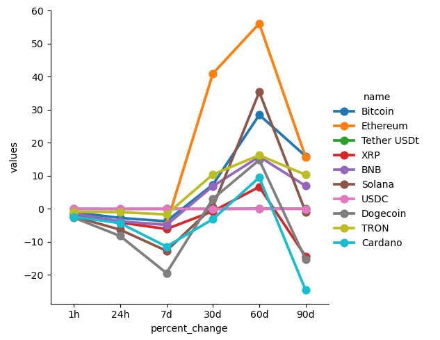

# Crypto Web Scraping

This is a program that scrapes data from the CoinMarketCap website using the site API. Many things could be done with this data. Here, I use it to track the growth of the 10 biggest cryptocurrencies.

CoinMarketCap provides code to use their API, which I incorporated into a function, run_api. The function scrapes the site data and records it in a CSV file. It also has a 1-minute sleep timer built in. The idea is to fun the program continuously in the background for it to collect data, but in the actual script, I have it set to stop after 5 min.

In the second part of the script, I reformat the data frame as a stack for convenience. Then I use the data to graph the growth of the 10 biggest crypto currencies.

